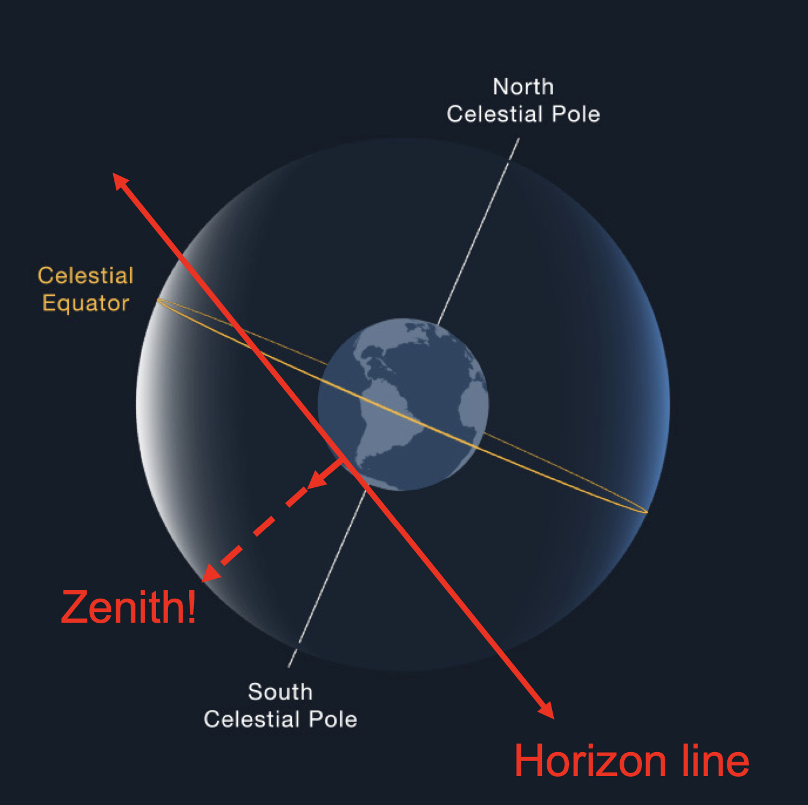
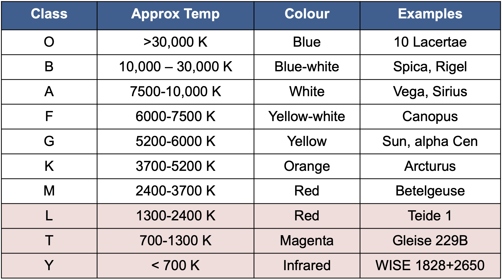
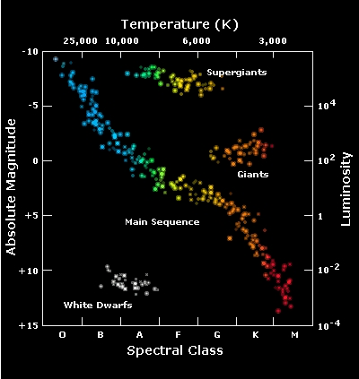
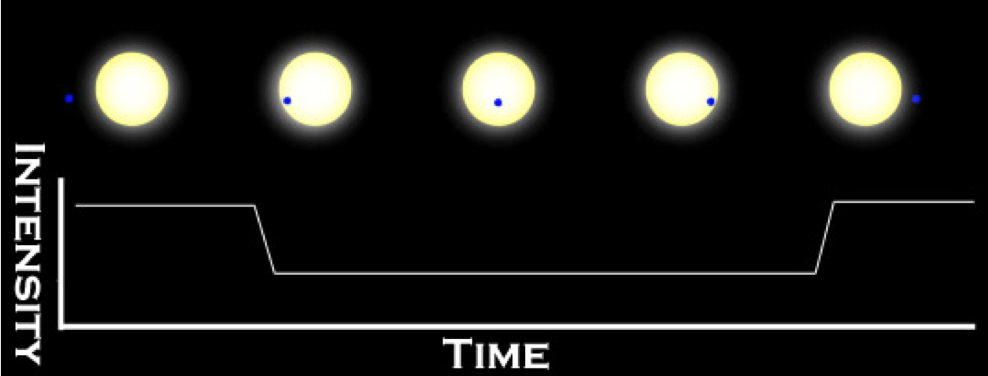

## **THE SKY ABOVE THE BRIEF HISTORY OF MODERN ASTRONOMY**

 

### **Zenith**

 

### **Celestial Sphere**

 

### **Rising and Setting of the Sun**

- Sun moves about 1° to the east, appears to rise about 4 minutes later each day
- **Solar Day (24 hr)**  
  Time it takes for the Earth to rotate about its axis so that the Sun appears at the same position in the sky
- **Sidereal Day (23 hr 56 min)**  
  The time it takes for the Earth to rotate about its axis so that the distant stars appear in the same position in the sky 

   

### **Earth's Tilt**

Celestial equator is tilted by 23.5° to the ecliptic

 

### **Precession**

- Axis of Earth wobbles in a 26000-year cycle.
- Today, north celestial pole is near the star Polaris

 

### **Retrograde Motion**  

 

___
___

 

## **Kepler's Laws of Planetary Motion**
$$
\text{Eccentricity} = \frac{\text{Distance between foci}}{\text{Semi-major axis}}
$$
** Eccentricity = 0 -> Circle

| Kepler's Laws | Theory                                                         |
| ------------- | -------------------------------------------------------------- | 
| $1st$ Law     | Planetary orbits are ellipses with the Sun at one focus        | 
| $2nd$ Law     | In equal intervals, a planet's orbit sweeps out equal areas    |
| $3rd$ Law     | $P^2 = a^3$                                                    | 

- According to Kepler's Laws, Mercury must have the shortest orbital period (88 Earth Days): It then has the highest orbital speed, averaging $48km/s$.
- The cometary orbits are highly elliptical, unlike planets and asteroids 
  

___
___

 

## **Newton's Laws of Motion**
| Newton's Laws | Theory                                                    |
| ------------- | --------------------------------------------------------- | 
| $1st$ Law     | Inertia                                                   |
| $2nd$ Law     | $F=ma$                                                    |
| $3rd$ Law     | For every action there is an equal and opposite reaction  |

**Momentum**  
 A measure of the motion of an object and depends on both its mass and its velocity  
 $Momentum = Mass * Velocity$ 
   

**Angular Momentum**  
A measure of rotation of a body as it revolves around some fixed point  
$Angular Momentum = Mass * Velocity * Radius$

** Kepler's second law is a consequence of the conservation of angular momentum!
  

___
___

 

### **Newton's Universal Law of Gravitation**  
$F_g = G\frac{M_1  M_2}{d^2}$
  

### **Kepler's Third Law (Solar System)**</ins>  
$P^2 = a^3$  
** P in years, a in AU
  

### **Newton's Version of Kepler's Third Law (! Solar System)**  
$P^2 = \frac{4 \pi^2} {G(M_1 + M_2)}a^3$  
** P in seconds, M in kg, a in meters

 

### **Which Kepler's Law to use?**
- If we have planets orbiting a star of mass = 1 solar mass, we can use Kepler's version
- Other situations: use Newton's version of Kepler's third law

 

___
___

 

## **EARTH, MOON AND SKY**   

### **Consequences of the Earth's Tilt**

- **June**: North experiences summer and have longer days
- **December**: Northern Hemisphere experiences winter
- In spring and autumn, two hemispheres receive more equal shares of sunlight
- In summer, Sun appears high in the sky and its rays hits Earth more directly
- In winter, the Sun is low in the sky and its rays spread out over a much wider area, less effective at heating the ground

 

### **Solstices and Equinoxes** 
   

**Winter Solstice in Southern Hemisphere (June 21)**

- North Pole (24 hours of constant sunlight)
- South Pole (24 hours of constant darkness)   

**Spring Equinox in Southern Hemisphere (September 21)**

- Sun is directly over the equator 
- Equal night   

**Summer Solstice in Southern Hemisphere (December 21)**

- North Pole (24 hours of constant darkness)
- South Pole (24 hours of constant sunlight)   

**Autumanl Equinox in Southern Hemisphere (March 21)**

- Sun crosses over the equator again
- Days and nights are again the same length   

___

 

### **Coordinate System on the Sky**

- **Declination**: Similar to latitude, celestial equator = 0 degrees
- **Right ascension**: Similar to longitude, measured in hours

 

### **Star Motion Across the Sky**
- The star rises 4 minutes earlier each day
- If a constellation of stars rises at sunset in winter, the by summer that constellation will rise 12 hours earlier, with the sunrise and it will be difficult to see

 

___

 

### **Phases of the Moon**

- Moon's orbital period: 27.3 days
- Time between lunar phases is longer (29.5 days)
- Why?
  - Lunar phases are observed with respect to the position of the Sun
  - Moon takes 27.3 days to orbit the Earth
  - Earth moved its orbit around the Sun
  - Moon needs another 2.2 days in its orbit to make up for that additional distance and complete the phase cycle

  

### **The Rotation of the Moon**

- If the Moon did not rotate as it orbited Earth, it would present all its sides to our vide

- The Moon rotates in the same period that it revolves
- We always see the same side of the Moon
  
  

### **Pull of the Moon**

### **The Formation of Tides**

- Difference in gravity cause tidal forces that push water in the direction of tidal bulges on Earth
- Gravitational force from the Moon and the SUn causes tides
- This is a flow of water toward the two regions above and below the Moon

 

___

 

### **Solar Eclipse**

- Position 1: Total eclipse
- Position 2 & 3: Partial solar eclipse
- Position 4: Annular eclipse
- At position 4, Moon is further away, cannot cover the Sun completely

 

___
___

 

## **RADIATION AND SPECTRA**

### **Photons and Waves**
**Photons**: particles of light  
**Wave**: Pattern of motion that can carry energy without carrying matter along with it  

$c = λ * v$

 

### **Inverse Square Law of Light**
$Intensity \sim 1/d^2$

 

### **Electromagnetic Spectrum**

- High-frequency waves from space fo not make it to the surface, hence must be observed from space
- Some infrared and microwaves are absorbed by water, thus best observed from high altitudes
- Low-frequency radio waves are blocked by Earth's ionosphere

 

### **Wien's Law**
$\lambda_{\text{max}}(nm) = \frac{2.9 * 10^6}{T(K)}$  

Hot stars emit more photons at shorter wavelengths than cooler stars, which emit ostly at longer wavelengths

 

### **Types of Spectra**

 

### **Resolution of Telescope**
Resolution refers to the precision of detail present in the image. It is determined by the size of the primary mirror and the wavelength being observed.   
$R(radians) = 1.22\frac{\lambda(m)}{D(m)}$

1 arc minute = $\frac{1}{60}$ of a degree  
1 arc second = $\frac{1}{60}$ of an arc min 

 

___
___

 

## **THE SUN**

### **The solar Composition**

**How do we determine the solar composition?**
- Use absorption lines of the Sun's spectra to determine the aubndance of most elements
- We don't see absorption lines in the Sun's spectra for some elements (e.g., Helium, Neon, Argon, Krypton, Mercury, Uranium etc)
- For these elements we have other methods (e.g., emission lines from the solar corona for Neon)

 

### **The Structure of the Sun**

**From inner to outer layer:**
- Core
- Radiative zone
- Convective zone
- Photosphere
- Chromosphere
- Corona

 

**Solar granulation**  

The formation of solar granules is driven by the convective motion of plasma within the Sun's photosphere. As energy generated in the solar interior reaches the surface, it heats up the plasma, causing it to rise due to buoyancy. These rising hot plasma cells are called convection cells or upflows. As they reach the surface, they cool down and descend back into the interior along the darker lanes, forming the downdrafts.

 

**How can we find the rotation rate of the Sun?**
- Use sunspots to infer the rotation rate of the Sun
- Period of Sun's equator (~24 days)
- Period of Sun's pole (~35 days)

 

**Solar Cycle**

- Also known as sunspot cycle
- Is a recurring pattern of changes in solar activity
- Occurs over approximately 11 years, with fluctuations in the number of sunspots and other solar phenomena
- During periods of high solar activity (solar maximum), the number of sunspots increases, along with solar flares and coronal mass ejection
- Solar flares and coronal mass ejections release large amounts of energy and can impact Earth's space weather and geomagnetic activity

 

**Solar Wind**

- A stream of charged particles that are emitted from the upper layers of the SUn's atmosphere and mostly from the corona
- It is a plasma consisting of electrons, protons and alpha particles

 

**Magnetism and Solar Rotation**

- Sun spins faster at the equator than the poles
- Magnetic fields tend to wind up

 

___
___

 

## **ANALYSING STARLIGHT**

### **Examining Magnitudes in More Detail**
- Smaller magnitudes -> Brighter
- Bigger magnitudes -> Dimmer
- Magnitude is a logarithmic scale
- A difference of 5 magnitudes is equal to a factor of 100 in brightness
- $\triangle m = 5 \rightarrow 100:1$
- $\triangle m = 1 \rightarrow (100)^\frac{1}{5} \approx 2.512:1$
- This means that a $1^\text{st}$ magnitude star is 2.512 times brighter, $2^\text{nd}$ magnitude star is $2.512^2$ times brighter, and so on..
  
$$\frac{f_2}{f_1} = 100^{\frac{m_1 - m_2}{5}} = 100^{0.2(m_1 - m_2)}$$

Solving for magnitudes:  
$$5log_\text{100}\frac{f_2}{f_1} = m_1 - m_2$$

$$or$$

$$m_1 - m_2 = 2.5 log_{10}\frac{f_2}{f_1}$$

 

### **Luminosity and Flux**
$$ L = 4 \pi d^2 F$$
- Suppose a star emits energy equally in all directions
- d = distance to the star
- F = the observed flux from the star
- Inverse square law:
  - $F = \frac{L}{4\pi d^2}$

 

### **Classifying Spectra**
Hot stars:
- Atmospheres are completely ionized
- For hydrogn, protons and electrons are separate
- For hydrogen absorption lines to appear, we need some hydrogen with their electrons attached in the atmosphere of the star

Cool stars:
- Most H atoms have their electrons in the ground state
- Photons with enough energt to transition to n=1 to n=2 liie in the ultraviolet part of the electromagnetic spectrum 
- There are very few ultraviolet photos in the radiation from a cool star

 

**Spectral Classes**

* L, T and Y are newer classifications added to account for very low-mass red dwarf stars and brown dwarfs

 

**Brown dwarfs**  

Brown dwarfs are celestial objects that fall between the definitions of planets and stars. They are often referred to as "failed stars". Brown dwarfs are not massive enough to sustain the fusion of hydrogen in their cores, which is the process that powers stars.

Characteristics:
- Mass range between about 13 $M_\text{Jupiter}$ and 80 $M_\text{Jupiter}$ 
- Typically larger than gas giant planets
- Have a relatively low surface temperatures compared to stars. Emit energy primarily in the infrared part of the electromagnetic spectrum
- Form through the same processes as stars, by the gravitational collapse of a cloud of gas and dust, but lack the mass necessary for the sustained fusion reactions that characterize stars

 

**The Size of Stars**

- Giant star with a very low pressure photosphere shows very narrow spectral lines (bottom)
- Smaller star with higher-pressure photosphere shows much broader spectral lines (top)
- This is due to collisions in the star's photosphere
- More collisions lead to broader spectra lines (as in a high density environment)

 

### **Stefan-Boltzmann Law**

Relationship between the luminosity emitted by a star and it's temperature and size: 

$L = 4 \pi R^2 \sigma T^4$

 

### **Radial Velocity**

- Spectral lines shifted toward red end of the spectrum -> Star is moving away from us
- Spectral lines shifted toward blue end -> Star is moving toward us
- Such motion, along the line of sight between the star and the observer is called radial velocity 
- Usually measured in km/s
- The greater the shift, the faster the star is moving
- We use the radial velocity method to determine how fast stars are moving away or toward us here on Earth
- Also use it to find binary stars orbiting each other, or planets around stars

$$\frac{\triangle \lambda}{\lambda _0} = \frac{\lambda - \lambda _0}{\lambda _0} = \frac{v}{c}$$

 

**Radial Motion VS Proper Motion** 

Radial Motion
- Refers to the motion of an object along the line of sight, either moving toward or away from an observer
- Measured in terms of radial velocity, which indicates the rate at which the object is moving toward or away from the observer

Proper Motion
- Refers to the motion of an object across the sky relative to distant background objects
- Typically measured in units of angular displacement per unit of time (e.g., arcseconds per year)
- Reflects the object's velocity perpendicular to the line of sight

 

**Space Velocity of Stars**

 

**Stellar Rotation**

- A rotating satr will show broader spectral lines than a non-rotating star
- This is due to the Doppler effect
- Doppler effect is the change in wavelength or frequency of light due to the relative motion between the source of light (the star) and the observer (us)
- In rotating star, different regions of the star's surface are moving toward or away from the observer due to the star's rotation
- This creates variations in the velocity of different parts of the star's surface relative to the observer
- If a star is rotating rapidly, there will be a greater spread of Doppler shifts and all its spectral lines should be quite broad

 

___
___

 

## **THE HERTZSPRUNG-RUSSELL DIAGRAM**

### **HR Diagram for Many Stars**

- 90% of all stars fall along a narrow band called the **main sequence** (Hydroge burning)
- Minority of stars are found in the upper right 
  - Cool, red and bright
  - Must be giants (Exhausted H in their cores)
- Some stars fall in the lower left of the diagram 
  - Hot and dim
  - Must be white dwarfs
  - Embers of stars, the hot stellar remnant left behind

 
  
**The Most Common Stars**

- 80% of stars in our local solar volume are M dwarfs
- Only 10% of stars are like our Sun
- The other 10% are likely to be sub-stellar objects: Brown dwarfs

 

**Deuterium Fusion**

- Deuterium fusion or heavy hydrogen $(d + p \rightarrow  ^3He + energy)$ can occur in objects down to 0.012 solar masses ($13M_\text{jupiter}$)
- Objects with masses between $0.012M_\text{sun}$ and $0.07M_\text{sun}$ aren't stars but aren't planets either
- Problem is that there isn't much deuterium (it's a rare isotope of H)
- Brown dwarfs quickly run out of it
- They start to shrink and cool

 

**Problem of Finding Brown Dwarfs**

- Brown dwarfs should emit no visible light, with most light emitted in the infra-red
- They are also incredibly dim
- Brown dwarfs are predicted to be cooler and dimmer than stars
- But they can have similar temperatures and luminosities to read dwarf stars, especially when they are young

 

**Lithium Test Method**

The isotope of the element lithium, $^7Li$ can be easily destroyed by fusion with protons at low temperatures. 

$^7Li + p \rightarrow ^8Be \rightarrow 2 ^4He + energy$

- In low mass stars like red dwarfs, which are similar in mass to bworn dwarfs, lithium is rapidly depleted through nuclear fusion reactions in their cores.
- ON the other hand, brown dwarfs do not have sufficient mass and internal pressure to sustain sustained nuclear fusion, so lithium i their atmospheres can remain relatively abundant

 

**Convection in Very Low-Mass Stars**

- In our Sun, convection is only in the surface layers
- In M red dwarf stars, the whole star is convective
- What does this mean?
  - The whole star is mixed through the hot central core
  - All of the Li in the star is eventually destroyed

 

**Brown Dwarf Formation**

 

___
___

 

## **BINARY STARS**

There are several types of binaries:
1. Visual binary
   - We call two stars a visual bianry when we can see them in a telescope
2. Spectroscopic binary
   - The stars in the binary system are so close together or so distant from Earth that they appear as a single point of light when observed with telescopes
   - This can make it difficult to directly observe the individual stars and discern their characteristics
   - Their presence and properties are inferred indirectly through spectroscopic observations
3. Eclipsing binary
   - A type of binary star system where two stars orbit each other in such a way that they periodically pass in front of, or eclipse, one another as seen from Earth
   - These eclipses cause regular and predictable changes in the system's observed brightness

 

**Spectroscopic Binary: Moving Lines**

 

___
___

 

## **STELLAR MASSES**

### **Range of Stellar Masses**
Mass that stars ranges from
$$0.1 M_\text{sun} \leq M_\text{sun} \leq 100 M_\text
{sun}$$ 

**Minimum**
- A star is something that generates energy by fusion
- If the temperature is too low, then there is no fusion
- Need $M \geq M_\text{sun}$
- Any lower and it is a "brown dwarf"

**Maximum**
- As stars get bigger they get hotter
- If too hot they cannot remain stable
- High energy photons make this impossible
- Stars lose mass rapidly through strong pulsations
- We need $M \leq 100 M_\text{sun}$

 

___
___

 

## **STELLAR LUMINOUSITIES**

### **Mass-Luminosity Relation**

$$L \propto M^4$$

For some constant $k$ we have:
$$L = kM^4$$

And hence
$$\frac{L}{L_\text{sun}} = (\frac{M}{M_\text{sun}})^4$$

 

___
___

 

## **PARALLAX FOR NEARBY STARS**

### **Parallax Distance Formula**
$$\tan (p) = \frac{a}{d}$$
but for small angles (small value of $p$)
, $\tan (p) \approx p$
$$p=\frac{a}{d}$$

**$p$ in radian, not degree!!**

**1 parsec represents the distance to a star with parallax of 1 arc second**

 

___
___

 

## **CEPHEID VARIABLES**

### **Variable Stars: Cepheids**

The light curve shows how the brightness changes with time for a typical cepheid variable, with a period of about 6 days.

- Period ranging from about 3 to 50 days
- Luminosities are about 1000 to 10000 times the solar value

 

### **Using Cepheid**

- The pulsation is related to average luminosity

**Period-Luminosity Relation**

$$L_\text{observed} = \frac{L_\text{intrinsic}}{d^2}$$

- The time the star takes to go through a cycle of luminosity changes is related to the average luminosity of the star. 

 

### **How to Use a Cepheid to Measure Distance?**
1. Find a cepheid variable star and measure its period
2. Use the period-luminosity relation to calculate the star's luminosity
3. Measure the star's apparent brighness
4. Compare the luminosity with the apparent brightness to calculate the distance

 

### **Luminosity Classes**
- Ia: Brightest supergiants
- Ib: Less luminous supergiants
- II: Bright giants
- III: Giants
- IV: Subgiants (intermediant between giants and main sequence stars)
- V: Main-sequence stars (dwarfs)

### **Distance Method**

 

___
___

 

## **PLANETS OURSIDE THE SOLAR SYSTEM**

### **Types of Exoplanet**

**Many extrasolar planets are very close to their parent stars!**

- Radial velocity and transit methods are more senstitive to parents close to parent stars

 

### **Making Gas Giants and Hot Jupiters**
**Solar System**
- Stellar wind from young Sun blew volatiles outwards
- Frost line at 5 AU where water-ice solidified 
- Fast accretion of large icy planet (~10 $M_\text{Earth}$)
- Jupiter, Saturn just outside "frost line"
- Small rocky planets inside
- Slowly accreting icy planets in outer system (Uranus, Neptune)

**Extrasolar Hot Jupiters**
- Have extremely high temperatures
- Gas giant planets similar in size to Jupiter, but have very close orbits to their host stars
- Short orbital periods
- Close orbits and high temperatures are believed to be the result of migration
  - Form farther away from their star abd the migrate inward due to gravitational interactions or other processes

 

___
___

 

## **BETWEEN THE STARS: GAS AND DUST IN SPACE**

### **Why is the Sky Blue?**
- Light enters the atmosphere from the Sun
- Photons collide with
  - Gas molecules
  - Particles of dust
- Scattering is most efficient when the collisions are between things of similar size
- Dust particles are about the same size as the wavelength of **BLUE** light
- So blue scatters all around the sky
- Hence Sun is more yellow, having lost some of its blue light

 

### **The Same Happens in Space**

**Blue light scattered**
- Less blue light seen
- This is known as reddening

**Red light absorbed**
- Object is reduced in overall intensity
- Also known as "extinction"

 

### **Scattering by Dust**

- Interstellar dust scatters blue light more efficiently than red light
- Making distant stars appear redder and giving clouds of dust near stars a blueish hue
- Similar process makes the Earth's sky look blue

 

### **Infrared VS Optical**

Interstellar extinction is much smaller at infrared that at visible wavelengths, so the stars behind the cloud become visible in the infrared channel.

 

### **Interstellar Dust Grains**

 

### **Propagating Star Formation**

- Star formtion can move progressively through a molecular cloud
- Oldest group of stars lies to the left of the diagram and has expanded because of the motions of individual stars
- Eventually disperse and no longer be recognizable as a cluster
- Youngest group of stars lies to the right
- Pressure of the hot, ionized gas surrounding these stars compresses the material in the nearby edge of the molecular cloud
- Initiates the gravitational collapse that will lead to the formation of more stars

 

### **Star Formation**

1. Dense cores form within a molecular cloud
2. A protostar with a surroundng disk of material forms at the centre of a dense core, accumulating additional material from the molecular cloud through gravitational attraction
3. Stellar wind breaks out but is confined by the disk to flow out along the two poles of the star
4. Eventually, wind sweeps away the cloud material and halts the accumulation of additional material, and a newly formed star, surrounded by a disk, becomes observable.

 

___
___

 

## **FINDING PLANETS AROUND OTHER STARS**

### **Detection Methods**

**1. Direct**
   - Pictures or spectra of the planets themselves
  
**2. Indirect**
   -  Measurements of stellar properties revealing the effects of orbiting planets

 

### **Indirect - The Radial Velocity Method**

**Radial Velocity Method: Binary Star**

$\lambda = 5231.0$ 

$\triangle \lambda = 3.4$ 

$\frac{\triangle \lambda}{\lambda} = \frac{3.4}{6231.0} = 6.5 x 10^{-4}$ 

$v = \frac{\triangle \lambda}{\lambda}c = 195 km/sec$

 

**Understanding the Velocity Curve**

**Visualize the System**

**What can Doppler Shifts Tell Us**

 

### **Indirect - The Transit Method**

As a planet transits, it blocks out some of the light from the star, causing a temporary dimming in the brightness of the star.

1. Out of transit
2. Transit ingress
3. Full drop in brightness

 

**Transit Photometry**

- Measure the light decrease
- Gives information about size of planet
- Duration gives information about period

 

### **Indirect - Gravitational Microlensing**

- States that the gravitatinal field of a massive object can bend the path of light passing near it
- The bending of light is what gives rise to gravitational lensing

 

___
___

 

## **STELLAR EVOLUTION**

### **Main-Sequence Star Summary**

**High-Mass Star:**
- High luminosity
- Short-lived
- Larger radius
- Blue

**Low-Mass Star**
- Low luminosity
- Long-lived
- Small radius
- Orange-Red

 

### **Ages**
- More massive stars burn brighter
- Higher mass requires higher pressures to support the star
- This means higher T
- Burning rate increases rapidly with T
- More massive = much brighter
- Lifetimes shorter due to rapid burning

$t \propto \frac{M}{L}$

$t \propto \frac{M}{L} \propto \frac{M}{M^4} \propto M^{-3}$

$t \propto M^{-3}$

$\frac{t}{t_\text{Sun}} = (\frac{M}{M_{Sun}})^{-3}$

 

### **Stars on the Main Sequence**

 

### **CNO Cycle for H Burning**

 

### **Shell H Burning: Away from the MS**

**Star Layers during and after the Main Sequence**

During the main sequence, a star has a core where fusion takes place and a much larger envelope that is too cold for fusion.

When the hydrogen in the core is exhausted (made of helium, not hydrogen), the core is compressed by gravity and heats up. The additional heat starts hydrogen fusion in a layer just outside the core.

 

### **Main Sequence to the Red Giant Branch**

- Solid black lines show the predicted evolution from the main sequence through the red giant or supergiant stage on the H-R diagram.
- The red line is the zero-age main sequence

 

### **Star Clusters**

**Globular Cluster**

- Large, old, million stars
- Formed early in the galaxy'shistory
- Tightly packed and gravitationally bound
- Found in the outskirts of galaxies, mostly in halo and central bulge

**Open Cluster**

- Irregular or loosely bound shape
- Relatively young, typically a few million years old
- Less tightly packed and not strongly bound
- Found mainly in the disk of galaxies (and spiral arm)

**Stellar Association**

- Similar to open clusters, but with larger size and even fewer gravtational bindings
- Loosely bound and less concentrated compared to open clusters
- Composed of young stars thta formed in the same region or molecular cloud
- Found in the spiral arms
- Typically have low stellar density

 

### **HR Diagram as Clusters Age**

 

### **Helium Burning**

- After H burning the core is full of He
- It contracts and heats
- Eventually hot enough for He to fuse
  $$_{2}^{4}\text{He} + _{2}^{4}\text{He} \rightarrow _{4}^{8}\text{Be}$$

  $$_{8}^{2}\text{Be} + _{2}^{4}\text{He} \rightarrow _{6}^{12}\text{C} + 2\gamma$$

  $$_{6}^{12}C + _{2}^{4}He \rightarrow _{8}^{16}O + \gamma$$

 

Once there is some $^{12}C$ then we can make $^{16}O$ via $He$ burning

 

### **Fate of the Sun**

1. The star evolves from the main sequence to be a red giant
   - Decreasing surface temperature
   - Imcreasing in luminosity
2. Helium flash occurs
   - Leading to readjustment of the star's internal structure
3. A brief period of stability
   - Helium is fused to carbon and oxygen in the core
   - Star becomes hotter and less luminous than it was as a red giant
4. Central helium is exhausted
   - Star becomes a giant again
   - Moves to higher luminousity and lower temperature
   - Star has exhausted its inner resources and will soon begin to die

 

### **The Death of Low-Mass Stars**

- Low mass stars do not get hot enough to burn beyond He (which produces C and O)
- Stars with $M < 8 M_\text{Sun}$
- They end their lives at the tip of the giant branch
- Mass is rapidly lost
- Mass forms a plenetary nebula
- The core forms a white dwarf

 

### **The Death of Massive Stars**

- After $He$ burning the core is composed of $C$ and $O$
- Massive stars then contract and get hot enough to burn $C$ and $O$ into $S$ and beyond, all the way to iron $Fe$
- Massive means $M > 8 M_\text{Sun}$

 

### **White Dwarf Formation**
- Near tip of giant branch the envelope is blown off in about 1 million years
- Leaves just the core which will become the white dwarf
- Inert $C$ and $O$ core
  - $H$ and $He$ shell die
  - Very little weight above them
  - No need to keep the pressure high
- No energy from core so it contracts and gets denser and denser
- Becomes tiny, dense white dwarf

 

### **The White Dwarf Limit**
- White dwarf's mass cannot be more massive than $1.4M_\text{Sun}$
- As its mass approaches $1.4M\text{Sun}$, the electrons must move at nearly the speed of light
- This is known as the white dwarf (or Chandrasekhar limit)

$M_{Ch} = 1.4M_\text{Sun}$

If this mass is exceeded, new form of matter: a neutron star will be formed.

 

### **Supernova Explosion (Type II)**

- Eventually the central core exceeds the Chandrasekhar mass
- The degeneracy pressure goes away because electrons combine with protons, making neutrons and neutrinos
- Neutrons collapse to the centre, forming a **neutron star**
- THis explosion expels the outer layers

 

### **The Death of Massive Stars**
 

 

### **Maximum Mass for a Neutron Star**
Neutron stars are supported by nuclear forces
- But there is a maximum mass that can support
- This is the Tolman-Oppenheimer-Volkoff mass $M_{rov} \approx 2.3M_{Sun}$
- Neutrons are squeezed out of existence
- A black hole is born
  
 

### **Pulsars**

A ***pulsar*** is a neutron star that beams radiation along a magnetic axis that is not aligned with the rotation axis

**Pulsar Beans**

As each beam sweeps over the Earth, light a lighthouse beam sweeping over a distant ship, we see a short pulse of radiation. This model requires that the magnetic poles be located in different places from the rotation poles.